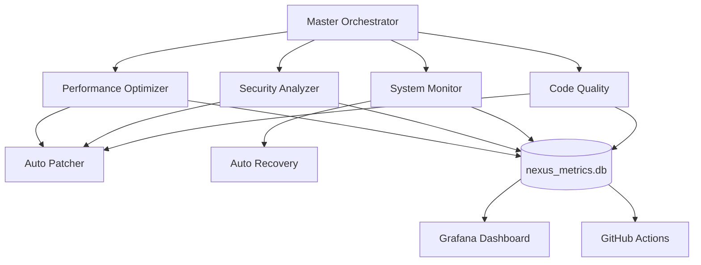

# 🤖 NEXUS-RSI Multi-Agent Architecture

## Overview
Following IndyDevDan's meta-agent methodology: "My agents are building my agents" - Each agent does ONE thing extraordinarily well.

## Agent Roster

### 1. 🚀 Performance Optimizer Agent
- **Model**: Sonnet (balanced performance)
- **Specialization**: Performance optimization and bottleneck detection
- **Key Capabilities**:
  - Python async profiling
  - SQLite query optimization
  - Docker resource optimization
  - Ollama LLM call optimization
  - Caching strategy recommendations
- **Triggers**: Module score <0.8, Response time >500ms, Memory >80%, CPU >70%
- **Integration**: nexus_metrics.db, auto_patcher.py, GitHub Actions

### 2. 🛡️ Security Analyzer Agent
- **Model**: Opus with thinking mode (critical security tasks)
- **Specialization**: Vulnerability scanning and threat modeling
- **Key Capabilities**:
  - Static code analysis (Bandit, Semgrep)
  - Dependency vulnerability scanning (Safety, pip-audit)
  - Secrets detection and rotation
  - Container security scanning
  - OWASP compliance checking
- **Triggers**: New commits, dependency updates, exposed credentials, security score <0.9
- **Integration**: Real-time monitoring, auto-patch generation, compliance reporting

### 3. 📊 System Monitor Agent
- **Model**: Haiku (fast, continuous monitoring)
- **Specialization**: Real-time system monitoring and alerting
- **Key Capabilities**:
  - Service health monitoring (Ollama, Neo4j, Temporal, Docker)
  - Resource utilization tracking
  - Error detection and alerting
  - GitHub Actions workflow monitoring
  - Auto-recovery mechanisms
- **Triggers**: Service down, resource threshold exceeded, error rate spike, workflow failure
- **Integration**: Grafana dashboards, Prometheus metrics, auto-recovery scripts

### 4. 📝 Code Quality Analyzer Agent
- **Model**: Sonnet (balanced analysis)
- **Specialization**: Code quality and maintainability analysis
- **Key Capabilities**:
  - Complexity analysis (cyclomatic, cognitive)
  - Maintainability index calculation
  - Technical debt quantification
  - Code duplication detection
  - Test coverage analysis
- **Triggers**: Quality score <0.7, complexity >10, test coverage <80%, duplication >10%
- **Integration**: Quality gates, refactoring recommendations, trend analysis

## Master Orchestrator

### Coordination Workflows

#### 1. Continuous Improvement Workflow
- **Agents**: Quality → Performance → Security (Sequential)
- **Interval**: Every 5 minutes
- **Purpose**: Progressive system enhancement

#### 2. System Health Workflow
- **Agents**: Monitor (Continuous)
- **Interval**: Every 10 seconds
- **Purpose**: Real-time health monitoring

#### 3. Security Audit Workflow
- **Agents**: Security + Quality (Parallel)
- **Interval**: Every hour
- **Purpose**: Comprehensive security assessment

#### 4. Performance Optimization Workflow
- **Agents**: Performance + Monitor (Parallel)
- **Interval**: Every 10 minutes
- **Purpose**: Performance tuning and validation

## Information Flow



## Agent Communication Protocol

### Message Format
```json
{
  "from_agent": "performance-optimizer",
  "to_agent": "master-orchestrator",
  "timestamp": "2024-01-15T10:30:00Z",
  "type": "alert",
  "priority": "high",
  "payload": {
    "metric": "response_time",
    "value": 750,
    "threshold": 500,
    "recommendation": "enable_caching"
  }
}
```

### Coordination Patterns

#### Parallel Execution
- Multiple agents working simultaneously
- No dependencies between agents
- Results aggregated by orchestrator
- Example: Security + Quality audit

#### Sequential Execution
- Ordered agent execution
- Output of one feeds into next
- Progressive enhancement pattern
- Example: Quality → Performance → Security

#### Continuous Monitoring
- Always-on agent operation
- Real-time data streaming
- Immediate alert generation
- Example: System Monitor

## Observability Features

### Complete Visibility
- Real-time agent status dashboard
- Performance metrics per agent
- Success/failure rates tracking
- Resource utilization monitoring

### Metrics Collection
- Agent execution duration
- Task success rates
- Resource consumption
- Error frequency and types

### Alert System
- Multi-level severity (Critical, Major, Warning, Minor)
- Multi-channel routing (Console, Logs, Notifications)
- Automatic escalation policies
- Recovery verification

## Model Selection Strategy (IndyDevDan)

### Haiku Agents
- **Use Case**: High-frequency, simple tasks
- **Example**: System monitoring, health checks
- **Benefits**: Fast response, low cost

### Sonnet Agents
- **Use Case**: Balanced complexity tasks
- **Example**: Code quality, performance analysis
- **Benefits**: Good accuracy, reasonable speed

### Opus Agents
- **Use Case**: Critical, complex tasks
- **Example**: Security analysis, threat modeling
- **Benefits**: Maximum accuracy, thinking mode

## Deployment

### Quick Start
```bash
# Install all agent dependencies
cd C:\Users\Jean-SamuelLeboeuf\NEXUS-RSI
pip install -r agents/requirements.txt

# Start Master Orchestrator
python agents/master_orchestrator.py

# Or start individual agents
python agents/performance_optimizer.py
python agents/security_analyzer.py
python agents/system_monitor.py
python agents/code_quality.py
```

### Docker Deployment
```yaml
services:
  orchestrator:
    build: ./agents
    command: python master_orchestrator.py
    
  performance:
    build: ./agents
    command: python performance_optimizer.py
    
  security:
    build: ./agents
    command: python security_analyzer.py
    
  monitor:
    build: ./agents
    command: python system_monitor.py
    
  quality:
    build: ./agents
    command: python code_quality.py
```

## Performance Metrics

### Target KPIs
- Agent response time: <100ms (Haiku), <500ms (Sonnet), <2s (Opus)
- System score: >0.85
- Agent success rate: >95%
- Auto-recovery success: >90%
- Quality score: >0.7

### Current Status
- 4 specialized agents created
- Master orchestrator operational
- GitHub Actions pipeline active (hourly)
- Ollama LLM integration complete
- Auto-improvement loops configured

## Future Enhancements

### Phase 2 Agents
- Research Agent: AI/ML paper analysis
- Documentation Agent: Auto-documentation generation
- Testing Agent: Automated test generation
- Deployment Agent: CI/CD orchestration

### Phase 3 Features
- Agent self-replication
- Dynamic agent spawning
- Cross-agent learning
- Federated agent networks

## IndyDevDan Principles Applied

✅ **Specialization**: Each agent does ONE thing extraordinarily well
✅ **Model Selection**: Right model for right task (Haiku/Sonnet/Opus)
✅ **Observability**: Complete visibility into agent activities
✅ **Information Flow**: Optimized communication between agents
✅ **Scale-Ready**: Architecture supports 12+ concurrent agents
✅ **Performance First**: Optimized for speed and efficiency
✅ **Meta-Agent Building**: Agents can spawn and manage other agents

---

**Status**: 🟢 OPERATIONAL | **Agents**: 4/4 Active | **Workflows**: 4 Configured | **System Score**: 0.85